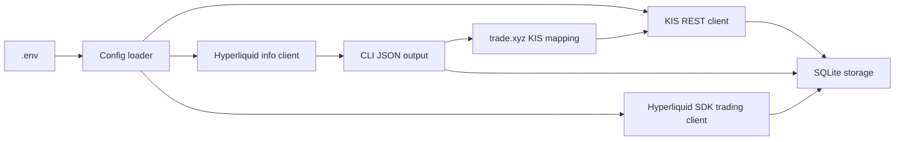

# Architecture

## Goals

The system has two responsibilities:

1. Collect reference market data through KIS and store raw payloads for traceable analysis.
2. Submit guarded Hyperliquid orders for BTC/USDC spot and trade.xyz RWA perpetual assets.

The project favors a narrow CLI-first shape before adding daemons or strategy automation.

## Components

`kis_hl.config` loads `.env`, validates account and key selection, and separates KIS sandbox/live credentials from Hyperliquid key profiles.

`kis_hl.kis.client` wraps KIS REST calls. It caches OAuth tokens on disk, throttles token refreshes, retries rate-limit responses with backoff, and exposes only market-data endpoints for now.

`kis_hl.kis_mappings` converts curated trade.xyz assets into KIS quote routes. It keeps RWA trading eligibility separate from KIS market-data availability, so an asset can be Hyperliquid-tradable while its KIS route is still `unsupported`.

`kis_hl.hyperliquid.client` wraps Hyperliquid public info calls with standard HTTP and uses `hyperliquid-python-sdk` only for signed trading. This avoids custom signing code.

`kis_hl.assets` normalizes user-facing symbols into Hyperliquid L1 names. `BTCUSDC` resolves to `UBTC/USDC` spot, and live spot orders resolve the pair through `spotMeta` to the `@index` order coin. trade.xyz assets resolve to `xyz:ASSET`.

`kis_hl.storage` persists raw KIS payloads, order submissions, trade.xyz asset rows, Hyperliquid verification checks, and KIS market-data mapping rows in SQLite. Raw payloads are stored because vendor schemas and exchange responses can change.

`kis_hl.trade_xyz_assets` defines the curated trade.xyz asset mapping seed. `trade_xyz_assets` rows in SQLite drive RWA eligibility: non-IPO assets and stocks listed for less than 30 weeks are excluded, `EWY` is excluded in favor of `KR200`, and `EWJ` is excluded in favor of `JP225`. `trade_xyz_asset_checks` records actual Hyperliquid metadata availability and is required for live trade.xyz orders. `trade_xyz_kis_mappings` records which KIS quote route, if any, can provide reference market data for the same trade.xyz asset.

`kis_hl.cli` provides operational commands. Live orders require `--live`; dry-run is the default.

## Data Flow

## Safety Decisions

- The first version does not implement autonomous strategy execution.
- Signed Hyperliquid actions use the SDK rather than hand-written signatures.
- The CLI stores raw order responses so order IDs, statuses, and error payloads remain auditable.
- Secrets are never logged intentionally and `.env` is ignored by git.

## Assumptions

- `.env` contains the correct key profile for the intended KIS and Hyperliquid environment.
- KIS sandbox mode is active unless `SANDBOX=false`.
- trade.xyz assets are available through Hyperliquid HIP-3 under the `xyz` dex namespace.
- BTC/USDC spot should use the Hyperliquid L1 name `UBTC/USDC` on mainnet.

## Open Risks

- The active trade.xyz asset list and session hours can change; validate metadata before live orders.
- KIS quote routing for NYSE Arca ETFs uses `AMS` and still needs live-account confirmation per ETF symbol.
- Direct KIS index quote routes for `KR200`, `JP225`, `SP500`, and `XYZ100` are not implemented.
- Hyperliquid SDK behavior for spot market orders should be tested with a small live or testnet order before using spot market orders operationally.
- KIS websocket subscriptions are not implemented in this first scaffold.
