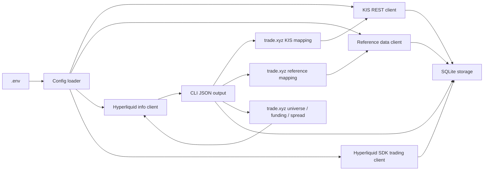

# Architecture

## Goals

The system has three responsibilities:

1. Collect reference market data through KIS and store raw payloads for traceable analysis.
2. Coordinate protected KIS cash and Hyperliquid BTC/ETH or eligible trade.xyz orders.
3. Reconcile actual account history into deferred, source-backed trade journals.

The project favors a narrow CLI-first shape before adding daemons or strategy automation.

## Components

`kis_hl.config` loads `.env`, validates account and key selection, and separates KIS sandbox/live credentials from Hyperliquid key profiles.

`kis_hl.kis.client` wraps KIS REST calls. It caches OAuth tokens on disk, throttles token refreshes, retries rate-limit responses with backoff, and exposes market-data, paginated account history/balances/orders, and dry-run-default cash order/cancel/amend adapters. POST outcomes are never blindly retried. The `kis-account` CLI outputs only a masked account and whitelisted summary amounts; it does not persist balance data.

`kis_hl.kis_mappings` converts curated trade.xyz assets into KIS quote routes. It keeps RWA trading eligibility separate from KIS market-data availability, so an asset can be Hyperliquid-tradable while its KIS route is still `unsupported`.

`kis_hl.reference_mappings` maps selected trade.xyz assets to secondary reference-data providers. The first provider is Yahoo Finance chart data for commodity, FX, and index cross-checks where KIS is unavailable or needs a fallback.

`kis_hl.kis_collector` executes mapped KIS routes for one symbol or a batch, stores raw payloads in SQLite, and reports per-symbol success, skipped, and failed states without stopping the whole batch by default.

`kis_hl.reference_collector` executes secondary provider routes, currently Yahoo Finance chart quotes, and stores normalized payloads in the same `market_ticks` table.

`kis_hl.daily_collector` collects historical daily OHLCV bars for tradable trade.xyz assets. It uses Yahoo reference mappings for commodity, FX, and index assets and exchange tickers for stock and ETF assets, then upserts rows into `market_daily_bars`.

`kis_hl.xyz_market_collector` snapshots the live Hyperliquid `xyz` universe, collects funding-rate history, and stores top-of-book spread snapshots. Universe asset rows also store Hyperliquid 24h base volume, 24h notional volume, and open interest when present. This keeps newly listed trade.xyz markets visible without immediately making them live-tradable.

`kis_hl.risk` implements deterministic strategy risk calculations: operating capital from Hyperliquid portfolio value, ATR from daily bars, 30-week EMA trend status, asset-class `N` defaults, and per-tranche position sizing.

`kis_hl.signals` implements deterministic signal rules. The first signal is a BTCUSDC futures 3H previous-high close breakout, which returns a long-entry intent.

`kis_hl.btc_strategy` turns Hyperliquid BTC spot websocket mids into 3H spot candles, creates a BTC perp long-entry plan when the latest closed candle close breaks the previous high, sizes the entry from an `80 USDC` notional, and attaches a reduce-only stop-market order at `entry_price - ATR(10D) * 2`.

`kis_hl.trade_journal` creates completed-position journal records and calculates the required review statistics from net return percentages rather than currency PnL. The formula, breakeven, ratio, and holding-day contract is owned by `.agents/skills/trade-journal/`.

`kis_hl.trading_hours` maps tradable assets to the underlying market session group and returns timezone-aware session decisions. Live non-reduce-only trade.xyz orders fail closed outside that session unless `--allow-outside-session` is passed. Reduce-only exits are allowed outside the entry session.

`kis_hl.streaming` provides a reconnecting websocket runner with subscription replay, bounded reconnect backoff, heartbeat support, and stale-stream detection.

`kis_hl.kis.ws` provides KIS websocket subscription payloads, approval-key acquisition through `KisClient`, KIS ping echo handling, and normalized price ticks for domestic and overseas trade feeds.

`kis_hl.hyperliquid.ws` provides Hyperliquid websocket subscription payloads, heartbeat ping support, default REST-to-websocket URL derivation, and normalized `allMids` ticks.

`kis_hl.hyperliquid.client` wraps Hyperliquid public info calls with standard HTTP, including wallet asset state reads for the configured address, and uses `hyperliquid-python-sdk` only for signed trading. This avoids custom signing code.

`kis_hl.assets` normalizes user-facing symbols into Hyperliquid L1 names. `BTCUSDC` resolves to `UBTC/USDC` spot, while explicit futures aliases such as `BTCUSDC-PERP`, `BTC-PERP`, and `BTCPERP` resolve to the Hyperliquid `BTC` perp coin. Live spot orders resolve the pair through `spotMeta` to the `@index` order coin. trade.xyz assets resolve to `xyz:ASSET`.

`kis_hl.storage` persists raw KIS payloads, daily OHLCV bars, order submissions, reduce-only stop-market protective orders, completed trade journal entries, trade.xyz asset rows, Hyperliquid verification checks, KIS market-data mapping rows, secondary reference-data mapping rows, live `xyz` universe snapshots, funding-rate rows, and spread snapshots in SQLite. Raw payloads are stored because vendor schemas and exchange responses can change.

`kis_hl.trade_xyz_assets` defines the curated trade.xyz asset mapping seed. `trade_xyz_assets` rows in SQLite drive RWA eligibility: non-IPO assets and stocks listed for less than 30 weeks are excluded, `EWY` is excluded in favor of `KR200`, and `EWJ` is excluded in favor of `JP225`. The seed also records Specification Index commodity and FX references. `trade_xyz_asset_checks` records actual Hyperliquid metadata availability and is required for live trade.xyz orders. `trade_xyz_kis_mappings` records which KIS quote route, if any, can provide reference market data for the same trade.xyz asset.

`kis_hl.cli` provides operational commands. Live orders require `--live`; dry-run is the default.

`docs/strategy_execution_design.md` records the planned strategy daemon design for operating-capital sizing, ATR stop-losses, application-level trailing exits, add-up logic, and KIS/Hyperliquid websocket responsibilities. Explicit protected-position trailing management is implemented as a supervised CLI worker; the broader autonomous entry/add-up strategy daemon remains unimplemented.

## Data Flow

Interactive, code-grounded views generated from repository revision
`e012d2533463b6dd38abf32aee09e150719177f3`:

- [High-level system architecture](architecture/system-architecture.html)
- [Live order request sequence](architecture/live-order-sequence.html)
- [Market data, eligibility, and audit flow](architecture/market-data-flow.html)

## Safety Decisions

- Autonomous entry/add-up orchestration remains unimplemented; explicit enrolled-position trailing exits are supported.
- Signed Hyperliquid actions use the SDK rather than hand-written signatures.
- BTCUSDC futures signal evaluation is available through `btc-3h-breakout`; websocket-driven dry-run/live execution is available through `btc-3h-monitor`.
- `btc-3h-monitor` submits the requested entry size and stop from the signal price. It does not yet reconcile existing BTC positions or confirm actual average fill price before deriving the stop.
- Trade journal entries are explicit CLI records until order/fill reconciliation can create them automatically at position close.
- Normal live entries for trade.xyz assets should follow the relevant underlying market session documented in `docs/trading_hours.md`, not Hyperliquid's broader availability.
- Hyperliquid stop-loss trigger orders are reduce-only and require an explicit trigger price.
- The CLI stores raw order responses and protective-order rows so order IDs, statuses, trigger prices, and covered size remain auditable.
- Secrets are never logged intentionally and `.env` is ignored by git.

## Assumptions

- `.env` contains the correct key profile for the intended KIS and Hyperliquid environment.
- KIS sandbox mode is active unless `SANDBOX=false`.
- trade.xyz assets are available through Hyperliquid HIP-3 under the `xyz` dex namespace.
- BTC/USDC spot should use the Hyperliquid L1 name `UBTC/USDC` on mainnet.

## Open Risks

- The active trade.xyz asset list and session hours can change; validate metadata before live orders.
- KIS quote routing for NYSE Arca ETFs uses `AMS` and still needs live-account confirmation per ETF symbol.
- `XYZ100`, `SP500`, and `JP225` use KIS overseas index intraday chart data, not a dedicated current-price quote endpoint.
- Commodity KIS rows are reference-only until overseas futures front-contract resolution is implemented from KIS futures master data.
- Spot metals and FX rows are reference-only until exact KIS quote routes are confirmed; futures proxies are intentionally not enabled.
- Yahoo Finance data is useful as a secondary cross-check, but it can be rate-limited and does not provide an exchange-licensed production data guarantee.
- Hyperliquid funding and spread snapshots are stored for suitability review only. They are not yet wired into automatic entry rejection, position sizing changes, or liquidation-risk checks.
- Hyperliquid SDK behavior for spot market orders should be tested with a small live or testnet order before using spot market orders operationally.
- The trailing worker consumes Hyperliquid allMids through the maintained connection layer. Persistent raw tick tables and unified KIS/Hyperliquid strategy orchestration remain unimplemented.

## Trailing management components

- `kis_hl.trailing`: pure Decimal policy and conservative receive-time 9-minute bar
  aggregation. Frozen risk distance and monotonic H/T are separate from execution.
- `kis_hl.trailing_storage`: versioned SQLite position snapshots, atomic exit
  decisions, pre-send UNKNOWN attempts, and structured state-event history. All
  `trailing_*` tables are initialized on first trailing CLI use. Prices and sizes
  are decimal strings; active generations and exchange cloids are unique.
- `kis_hl.trailing_runner`: enrollment verification, REST account/order/fill
  reconciliation, bounded IOC exits, managed-stop cleanup, WebSocket supervision
  and offline replay. See the strategy document for the behavior contract.
- `kis_hl.execution_lock`: reentrant POSIX account lock shared by the worker and
  signed client operations. All local live commands must use the same database;
  another host or external trading app is outside this ownership boundary.
- `kis_hl.streaming`: optional idle/disconnect callbacks let the owner persist
  degraded/reconciling state even when the managed symbol is silent.

The Hyperliquid adapter adds frontend open orders, order status by oid/cloid,
non-aggregated fills by time, explicit cloid forwarding, cancel-by-oid, and bounded
perpetual exit rounding. It loads both base and xyz SDK metadata. Generic order
rejections are distinguished from submission; this does not imply filled quantity.
The worker's attempts retain raw exchange responses independently of manual
`order_submissions` / `protective_orders` rows. Auto-journal creation remains absent.

## Protected trading implementation

| Responsibility | Implemented module/state |
| --- | --- |
| Analysis versus execution identity | `instruments.py`; explicit broker/listing/currency/underlying catalog |
| Account capability evidence | `capabilities.py`; append-only `capability_evidence` scoped to instrument/account/order/session validity |
| Exact KIS routes | `kis/client.py`, `kis/routes.py`; full pagination, no automatic write retry |
| Order ownership and recovery | `managed_execution.py`; `managed_positions`, `managed_intents`, `managed_attempts`, `managed_events`, `managed_supervisors` |
| Actual venue snapshots | `managed_gateways.py`; entry/exit/readback semantics, ATR provenance, price freshness and exposure caps |
| Future skill output and authority | `strategy_signals.py`; immutable `strategy_versions`, `strategy_signals`, bounded `execution_grants` |
| Actual-history ingestion | `journal_history.py`; native HL fills/funding and unresolved KIS/spot snapshots |
| Journal reconciliation and schedule | `journal_sync.py`; `journal_source_fills`, `journal_cash_costs`, `journal_sync_runs`, `journal_cycles`, `journal_sync_schedule`, `journal_position_checks` |
| Harness-neutral commands | `operations_cli.py`, registered by the existing `cli.py` parser |

The target Archify views show the managed entry path, external HTS/web execution
path, deferred journals and future strategy/notification boundaries. The implemented
supervisor directly reuses the deterministic `Trail` policy rather than handing
partial entries to the older single-position enrollment runner. Journal derivation
and publication share one SQLite transaction, so no separate asynchronous outbox
consumer is needed for local publication. Notification transport and strategy-code
execution remain future extension points. All three diagrams remain target-design
views; they do not claim a notification service is deployed.

SL and trailing provider decisions are independent. Native KIS SL/trailing remain
unverified; local protection requires an active worker. Exact HTS equivalence is not
assumed. The account supervisor serializes actual attempts while its journal worker
has a separate account lock and a configurable 10800-second default interval.
Unknown/manual positions are not automatically adopted. Their source history still
belongs in the journal independently of live eligibility.

Storage migrations are additive. Source revisions and old statistics snapshots are
retained. Missing costs, opening inventory, chronology or retention evidence stay
pending; KIS cumulative order rows need statement supplementation. Same-account
currencies and strategy populations are reported separately. Operational contracts,
rollout limits, commands and rollback are in [trading operations](trading-operations.md).

## Unified trading data storage

`data_store.py` and `data_migrations.py` add a versioned canonical schema to the
same local SQLite path. Immutable compressed payloads and source observations
feed indexed fact revisions; account ingestion/import, market series, quality
selection, journals and analysis consume those facts. `analysis_inputs` pins
transitive dependencies. Jobs and report artifacts have separate operational
attempt/publication state. Existing managed/trailing/eligibility tables remain
unchanged. CLI registration lives in `data_cli.py`.

The [data-flow diagram](../reports/sdlc/unified-trading-data/design/dataflow.html)
and [logical specification](../specs/unified-trading-data.md) describe the broader
design. The first implementation uses validated dataset payloads in a shared
fact table rather than every proposed physical table. The actual supported
adapters, precision/coverage limits, rollout, persistence and maintenance commands
are documented in [unified data operations](unified-data-operations.md).
