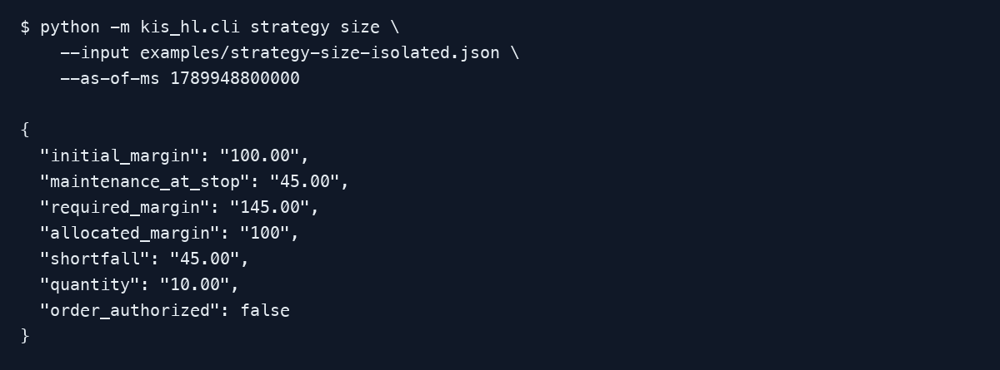

# Isolated margin at the fixed stop

This manual uses offline fixtures, not account data or live orders. PNG captures
show selected fields from actual CLI JSON stdout. Re-run the commands from the
repository root with Python 3.11+ and the declared runtime dependencies.

## Isolated margin at the fixed stop

Run `python -m kis_hl.cli strategy size --input examples/strategy-size-isolated.json --as-of-ms 1789948800000`.
The fixture sizes 10 ETH base units at entry 100 and SL 90. Initial margin is 100;
maintenance at SL is 45; required allocation is 145; the allocation of 100 is
short by 45. Quantity remains 10 and order authority remains false.

Supply fresh account/instrument-bound `margin_evidence` for real proposals. Its
allocation is collateral for the proposed tranche at entry. Missing or mismatched
evidence produces an unavailable report, not an invented zero shortfall. Funding,
fees, slippage and gaps are excluded; zero buffer is a maintenance boundary.
See the [full input/formula contract](../../strategy-tools.md#isolated-margin-at-the-fixed-stop).
