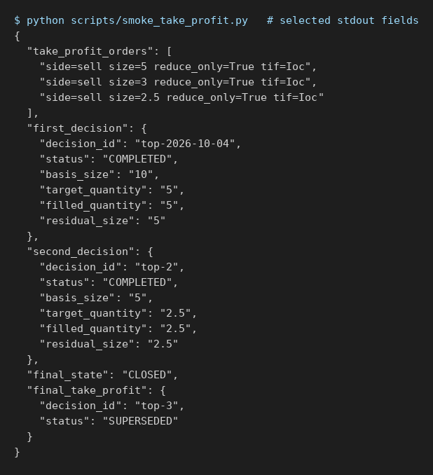

# Discretionary 50% take profit (Hyperliquid)

This manual uses the offline smoke, not account data or live orders. The PNG shows
selected fields from actual stdout of `python scripts/smoke_take_profit.py`, which
drives the CLI and the real Hyperliquid gateway over an in-memory exchange with the
network forbidden.

## Record one decision

Run `python -m kis_hl.cli order take-profit --id POSITION_ID --decision-id TOP_ID --rationale "Judged top"`
on a `PROTECTED` Hyperliquid owner. The command only records the decision
(`REQUESTED`); it never sends an order. Repeating the same decision ID is a no-op.
A used decision ID, a second concurrent decision, a pending add or exit, an
unprotected owner and KIS owners are rejected.

## Supervisor execution and result

The running supervisor (`supervisor run --venue hyperliquid --live`) freezes 50% of
the reconciled position, rounded down to the lot step, and sends reduce-only IOC
sells only for the unfilled remainder. In the smoke a 10 BTC owner received a
partial fill of 2, then one retry of 3, and finished `COMPLETED` with a residual of
5 still covered by the original fixed SL. A second decision halved the residual
(2.5) without counting the first decision's fills. A third decision was
`SUPERSEDED` when the SL filled first; no take-profit order or new protection was
sent for the flat position, and the owner closed.

## Check status

Run `python -m kis_hl.cli order status --id POSITION_ID` and read `take_profit`:
`status` is one of `REQUESTED`, `EXECUTING`, `COMPLETED`, `BELOW_MINIMUM`,
`EXHAUSTED` or `SUPERSEDED`, with `basis_size`, `target_quantity`,
`filled_quantity` and `residual_size`. A reason containing "reconcile manually" means
an ambiguous take-profit order outcome is never resent; protection continues and
adds stay blocked. Live Hyperliquid handling of oversized reduce-only protection
after the position shrinks is unverified. See the
[full contract](../../trading-operations.md#discretionary-50-take-profit-hyperliquid).
