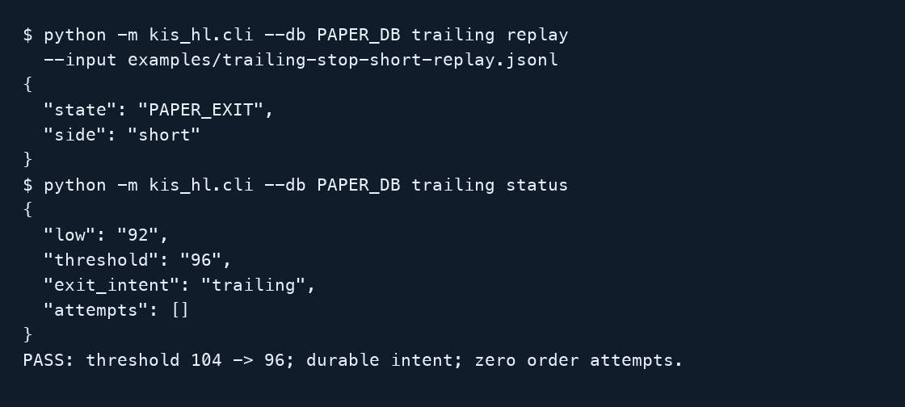
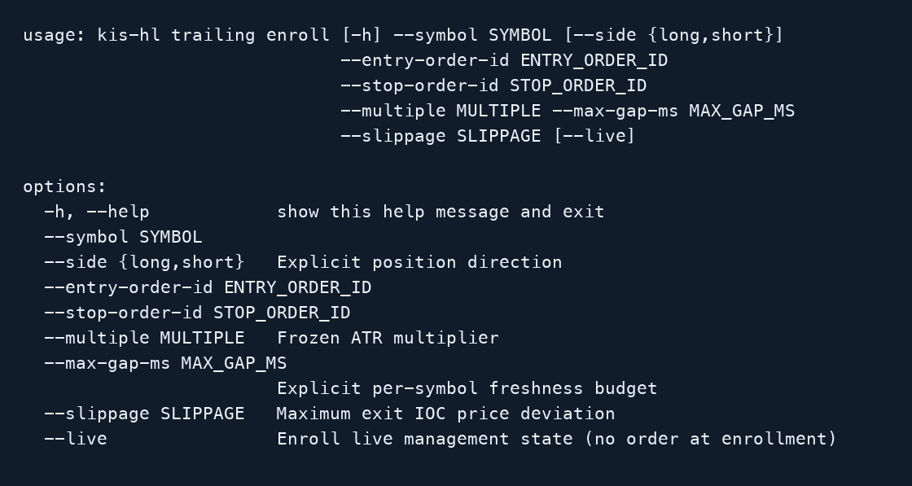

# Protected short trailing: operator manual

This route manages one already filled Hyperliquid short with verified native
protection. It does not open shorts. Managed strategy entries and adds remain
long-only. No live short lifecycle was exercised for this change.

## 1. Replay and verify without a network (S1)

Use a fresh paper database:

```bash
python -m kis_hl.cli --db /tmp/short-paper.sqlite trailing replay \
  --input examples/trailing-stop-short-replay.jsonl
python -m kis_hl.cli --db /tmp/short-paper.sqlite trailing status
```

The position header explicitly sets `side: "short"`. Entry is 100 and distance
is 4. The first bucket is incomplete; the completed next bucket has low 92.
At the next boundary, the threshold tightens from 104 to 96. Equality at 96
records PAPER_EXIT and a durable trailing exit intent. A separate process reads
that intent from SQLite and confirms zero order attempts. PAPER_EXIT assumes
no fill price. Headers without side remain long.



## 2. Explicitly enroll an existing protected short (S2)

Prerequisites: an eligible perpetual, terminal filled sell entry, complete fills,
matching negative exchange exposure and average entry, and an owned buy
reduce-only Stop Market covering the position. The stop must be at or below
entry + frozen ATR * multiplier. Use actual IDs in place of 123 and 456:

```bash
python -m kis_hl.cli --db data/kis_hl.sqlite trailing enroll \
  --symbol BTC-PERP --side short --entry-order-id 123 --stop-order-id 456 \
  --multiple 2 --max-gap-ms 15000 --slippage 0.01
python -m kis_hl.cli --db data/kis_hl.sqlite trailing run --position-id POSITION_ID
python -m kis_hl.cli --db data/kis_hl.sqlite trailing status --position-id POSITION_ID
```

Paper is the default. Enrollment reads exchange evidence and creates local
state; it creates no entry or protective order. The enrollment sequence above
was not run against an account. This capture shows the implemented CLI help:



## 3. Recovery and execution limits (S3)

Shorts track only completed, covered nine-minute bucket lows. Their threshold
never moves upward. A fresh price at or above the threshold requests an exit.
Disconnects and restarts discard partial buckets but retain confirmed thresholds.
No pre-enrollment low is inferred. Stored sizes are positive magnitudes with an
explicit side; old snapshots without side are long.

Live-shaped offline tests verify buy reduce-only IOC exits with inward rounding,
quantity rounded down, retained intent after partial fills and no blind resend of
an unknown submission. Residual retry needs terminal evidence. Flat cleanup only
cancels the enrolled, semantically matching stop after generation reconciliation.
Wrong-side stops, direction reversals, quantity increases, foreign entry/order
ownership or missing protection halt management. Existing retry/deadline limits
remain. MANUAL_INTERVENTION is latched; verify/protect the actual account before
operator-directed recovery. No live command is authorized by this manual.

Use the same SQLite path and account lock. Never manage the same coin alongside
a managed owner. Stop management before rolling back: an old binary cannot safely
read a short snapshot. See [operations](../trading-operations.md#single-position-short-trailing)
for the directional and recovery contract.

## Offline validation

```bash
python scripts/smoke_short_trailing.py
```

This invokes replay and status in separate processes against temporary SQLite,
checks the downward threshold and persistent intent, and deletes its database.
The captures above are rendered from actual CLI help/output; paper identifiers
and temporary paths are omitted from the selected-field display.
