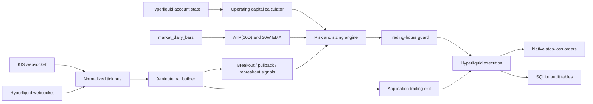

# Strategy Execution Design

This document describes the first live-trading design for trade.xyz RWA assets on Hyperliquid. No autonomous strategy execution is enabled until the remaining guardrails, tests, and reconciliation paths are implemented.

## Goals

- Trade only mapped and eligible trade.xyz assets.
- Use KIS as the preferred real-time price source when an active KIS route exists.
- Use Hyperliquid prices when KIS cannot provide the relevant live price.
- Size positions from portfolio value, ATR risk distance, and asset-class-specific risk multipliers.
- Place a native Hyperliquid stop-loss after entry fill confirmation.
- Simulate trailing-stop behavior in the application because Hyperliquid does not provide a native trailing-stop order type.
- Keep all live entry and add-up decisions inside the underlying market session unless an explicit risk override is added.

## Non-Goals

- No autonomous daemon is enabled in the current implementation.
- No short-selling strategy is defined yet. The initial design assumes long-only entries and long-position exits.
- No broker order routing is planned for KIS. KIS is a market-data source only.
- No optimization or parameter fitting is included in this design.

## Capital Model

The strategy uses an operating notional budget derived from Hyperliquid portfolio value:

```text
portfolio_floor_usdc = floor(portfolio_value_usdc / 1000) * 1000
operating_capital_usdc = portfolio_floor_usdc * 20
```

Example:

```text
portfolio_value_usdc = 2372.90
portfolio_floor_usdc = 2000
operating_capital_usdc = 2000 * 20 = 40000 USDC
```

Rules:

- If `portfolio_value_usdc < 1000`, the operating capital is `0` and new live entries fail closed.
- `kis_hl.risk.calculate_operating_capital()` implements this floor-and-multiply rule.
- Portfolio value must come from a fresh Hyperliquid account state snapshot.
- The 20x multiplier defines strategy notional budget, not permission to ignore Hyperliquid margin, leverage, or liquidation constraints.
- Available margin, max leverage, existing exposure, and per-asset caps must be checked before every order.

## Position Sizing

For each entry or add-up tranche:

```text
risk_budget_usdc = operating_capital_usdc * 0.01
stop_distance = ATR_10D * N
amount = risk_budget_usdc / stop_distance
entry_notional_usdc = amount * entry_price
```

The amount is the Hyperliquid base-asset size before lot-size rounding. The final submitted amount must be rounded down to the market's allowed size precision.

Example:

```text
operating_capital_usdc = 40000
risk_budget_usdc = 400
ATR_10D = 5
N = 2
stop_distance = 10
amount = 400 / 10 = 40 units
```

Sizing guards:

- ATR must be calculated from at least 11 daily bars because true range for day `t` depends on day `t - 1` close.
- `kis_hl.risk.calculate_atr_10d()` implements the daily true-range calculation.
- If ATR is missing, zero, stale, or calculated from incomplete daily data, live entry fails closed.
- `amount` must pass Hyperliquid minimum size, lot precision, and notional checks.
- Entry notional must fit within remaining operating-capital budget and account-level exposure limits.
- Add-up tranches use the same formula, but cumulative open risk must be capped separately.

## N Multipliers

Initial configurable defaults:

| Asset class | Initial `N` | Rationale |
| --- | ---: | --- |
| `equity_index` | 2.0 | Broad indexes generally gap less than single names. |
| `etf` | 2.5 | ETF gaps and tracking differences are higher than broad cash indexes. |
| `commodity` | 2.5 | Futures and spot-style commodity references can move sharply around inventory, weather, and macro events. |
| `fx` | 2.0 | FX is continuous on weekdays and usually lower-gap than equities. |
| `stock` | 3.0 | Single-name equities have event and gap risk. |

These are starting configuration values, not permanent strategy constants. They must be backtested and reviewed per asset class before live automation.

## Initial Stop-Loss

After an entry order is filled and the actual average entry price is known:

```text
long_stop_price = average_entry_price - (ATR_10D * N)
```

The execution engine must submit a reduce-only Hyperliquid stop-loss order for the filled position size. The preferred order is a stop-market style trigger order, because a stop-limit can fail to fill during a fast move.

Required behavior:

- Do not assume the requested entry price is the filled price.
- Wait for fill confirmation from Hyperliquid user-state/order/fill data.
- If a position opens and the stop-loss order cannot be placed, immediately submit a reduce-only market exit or enter a manual-intervention state.
- Store the stop order ID, client order ID, trigger price, covered size, and source ATR snapshot.
- Reconcile open positions and open stops on every restart.

Hyperliquid supports trigger-style orders through the exchange endpoint and `tp`/`sl` order semantics. The project wraps stop-market trigger payloads through `HyperliquidTradingClient.place_order(order_type="stop-market")` and `place_stop_loss_order()`. Submitted reduce-only stop-market orders are persisted in `protective_orders`, but full automation still needs fill reconciliation, ATR snapshot linkage, and restart reconciliation against live open orders.

## Application-Level Trailing Exit

Hyperliquid does not provide a native trailing-stop order type for this workflow, so trailing exit logic runs in the strategy process.

The trailing exit uses 9-minute bars:

```text
trail_distance = ATR_10D * N
high_watermark = max(9m_bar.high since position entry)
exit_trigger = high_watermark - trail_distance
exit when selected_live_price <= exit_trigger
```

Price-source priority:

1. KIS websocket price, when the asset has an active KIS route and the stream is fresh.
2. Hyperliquid websocket price, when KIS is unsupported, stale, unavailable, or outside a verified KIS route.

Rules:

- Do not blend KIS and Hyperliquid ticks inside the same 9-minute candle. Pick the active source for the candle and record it.
- If the primary source becomes stale mid-candle, close the current partial candle as degraded and start a new candle from the fallback source.
- A stale live price must not trigger a new entry or add-up.
- A stale primary source may trigger a risk-reduction exit only if the fallback source is fresh and confirms the exit condition.
- Use closed 9-minute candles for high-watermark updates unless a separate tick-level emergency exit is explicitly added.
- Keep the native Hyperliquid stop-loss active even when the application-level trailing exit is running.

## Entry And Add-Up Model

The initial strategy model is long-only and trend-following.

### Universe Filter

An asset is eligible for signal evaluation only when all conditions pass:

- `trade_xyz_assets.tradable = 1`.
- The Hyperliquid `xyz:` market has a recent successful verification row.
- The latest Hyperliquid `xyz` universe snapshot still contains the symbol.
- Recent funding-rate and spread snapshots are available for suitability review.
- Daily bars and ATR are fresh.
- The latest weekly close is above 30-week EMA. `kis_hl.risk.calculate_30w_ema_status()` implements the current weekly EMA calculation from daily bars.
- The underlying market session is open according to `docs/trading_hours.md`.
- The live price source is fresh.

### High-Probability Entry Gate

Every entry and add-up signal must pass a quality gate before risk sizing and order preparation. This gate keeps trade selection systematic instead of discretionary.

Required checks:

- Trend: the higher timeframe trend must agree with the trade direction. For this project, long-only entries require the 30-week EMA filter to pass and should prefer higher-high/higher-low structure on daily or 4H context.
- Confluence: the setup must have more than one supporting factor. Accepted factors can include support/resistance, moving-average alignment, prior breakout level, ATR band interaction, or another documented level. Confluence that is not machine-coded yet must be recorded as operator notes before live approval.
- Price action confirmation: the selected candle must confirm the entry. Examples include a close above resistance, a breakout-and-retest close, a rejection candle at support, or a bullish reversal pattern after pullback. A tick-only move is not enough for normal entries.
- Plan completeness: entry basis, stop-loss basis, take-profit or management plan, ATR snapshot, N value, and risk budget must be known before the order is sent.
- Risk and management: per-tranche risk must remain within the configured cap, stop-loss placement must be ready, and the trade must have a rule for breakeven stop movement or trailing-exit handling after price moves in favor.
- Reviewability: the setup label and entry-quality notes must be journalable so the completed trade can be reviewed against the original reason for entry.

The first implemented BTC rule satisfies only the price-action part of this gate by checking a closed 3H spot candle breakout. It still needs persisted confluence notes, trade-plan records, and fill-aware management before it should be treated as a fully automated high-probability entry system.

### Breakout Entry

Default intent:

- Buy when price breaks above a configured resistance or lookback high.
- Require confirmation from the selected live source.
- Store the breakout level, ATR snapshot, N value, operating-capital snapshot, and signal timestamp.

BTCUSDC futures rule:

- Resolve explicit futures symbols such as `BTCUSDC-PERP`, `BTC-PERP`, and `BTCPERP` to the Hyperliquid `BTC` perp coin.
- Use Hyperliquid BTC spot websocket mids as the monitoring price source.
- Build closed `3h` spot candles from those mids.
- The default breakout level is the immediately prior closed 3H candle high.
- A long-entry signal is valid when the latest closed 3H spot candle close is strictly greater than that breakout level.
- `--lookback-candles` can evaluate against the highest high across more prior candles, but the production default remains the immediately prior candle until backtests select a broader lookback.
- `kis_hl.signals.evaluate_btcusdc_futures_3h_breakout()` implements the candle breakout check.
- `kis_hl.btc_strategy.BtcSpotBreakoutPerpStrategy` wires spot websocket ticks to the breakout rule and creates a BTC perp long-entry plan.

BTCUSDC futures execution defaults:

- Entry instrument: Hyperliquid `BTC` perp via `BTCUSDC-PERP`.
- Entry side: long.
- Entry order type: market.
- Entry notional: `80 USDC`.
- Entry size: `80 / entry_price`.
- Stop-loss: reduce-only stop-market sell.
- Stop-loss trigger: `entry_price - (ATR(10D) * 2)`.
- ATR source: explicit `--atr-10d` override or Hyperliquid BTC perp `1d` candle snapshot.

Current limits:

- The monitor prevents duplicate entries only inside the running process.
- Existing BTC positions are not reconciled before live entry.
- Stop placement uses the signal close as entry reference until fill reconciliation is implemented.
- A restart can forget that an entry was already planned unless persisted position state is added.

### Pullback Add-Up

Default intent:

- Add only after the initial breakout position is profitable or at least not violating the current stop.
- Wait for a pullback toward a configured reference such as a short moving average, prior breakout level, or ATR band.
- Add when price resumes upward from the pullback area.

Guards:

- Do not add below the current effective stop.
- Do not add if cumulative open risk exceeds the portfolio-level risk cap.
- Each add-up tranche must have its own sizing record and stop-distance calculation.

### Rebreakout Add-Up

Default intent:

- Add when price breaks above the most recent post-entry swing high or consolidation high.
- Require the 30-week EMA filter and session guard to still pass.
- Recompute available risk and exposure before adding.

## Portfolio Risk Caps

Initial caps to implement before live automation:

- Per-tranche risk: `1%` of operating capital.
- Per-asset cumulative open risk: configurable, initially `2%` of operating capital.
- Total portfolio open risk: configurable, initially `6%` of operating capital.
- Max gross notional: no more than `operating_capital_usdc`.
- Max add-up count per asset: configurable, initially `2` after the first entry.

Open risk should be calculated from current stop distances, not from original entry intent. If a stop is raised or a trailing exit reduces risk, the available risk budget can be recalculated.

## Websocket Architecture

### KIS Stream Manager

Responsibilities:

- Authenticate REST and websocket credentials.
- Subscribe to real-time price feeds for active KIS routes.
- Maintain per-symbol stream status, last message timestamp, and parse errors.
- Reconnect with bounded exponential backoff.
- Resubscribe after reconnect.
- Emit normalized `price_tick` events with source, symbol, exchange, price, size, event time, receive time, and raw payload reference.

The official KIS sample repository uses websocket authentication before starting websocket subscriptions and includes domestic and overseas stock realtime examples. This project implements approval-key acquisition, subscription payload construction, ping echo handling, reconnects, and stale detection in `kis_hl.kis.ws`.

### Hyperliquid Stream Manager

Responsibilities:

- Subscribe to `allMids` for the `xyz` dex for RWA prices.
- Subscribe to user fill/order/clearinghouse state streams for execution reconciliation.
- Optionally subscribe to candle feeds for fallback bars, but local 9-minute bars should still be built from normalized ticks for consistency.
- Detect stale streams and reconnect with backoff.
- Emit normalized ticks and execution events.

Hyperliquid websocket subscriptions return a subscription response and then channel-specific data messages. The official websocket docs include `allMids` subscriptions, user events, fills, BBO, and candle subscriptions. This project implements subscribe payloads, heartbeat pings, reconnects, stale detection, and `allMids` tick parsing in `kis_hl.hyperliquid.ws`.

## Data Flow



## Proposed SQLite Tables

The existing `market_ticks`, `market_daily_bars`, and `order_submissions` tables are useful but not enough for a live strategy daemon.

Proposed additions:

| Table | Purpose |
| --- | --- |
| `portfolio_snapshots` | Hyperliquid account value, margin, and derived operating capital. |
| `market_price_ticks` | Normalized tick stream with source freshness metadata. |
| `market_9m_bars` | Local 9-minute OHLCV bars by selected source. |
| `asset_indicators` | ATR(10D), 30W EMA, latest weekly close, and calculation inputs. |
| `strategy_signals` | Breakout, pullback add-up, rebreakout add-up, trailing-exit signals. |
| `position_plans` | Intended size, stop distance, N, operating-capital snapshot, and risk budget. |
| `position_state` | Current reconciled Hyperliquid position, average entry, covered stop size, and high watermark. |
| `protective_orders` | Native stop-loss order IDs, trigger prices, status, and coverage checks. |
| `trade_journal_entries` | Completed trade records and review-statistics snapshots. |
| `stream_status` | Per-source connection health, last event time, reconnect count, and active subscriptions. |

Already implemented market-review tables:

| Table | Purpose |
| --- | --- |
| `trade_xyz_universe_snapshots` | Point-in-time Hyperliquid `xyz` universe snapshots, including new and missing symbols. |
| `trade_xyz_universe_assets` | Per-market metadata from each universe snapshot, including 24h base volume, 24h notional volume, and open interest when Hyperliquid provides them. |
| `market_funding_rates` | Hyperliquid hourly funding-rate and premium history by `xyz` symbol. |
| `market_spread_snapshots` | Top-of-book best bid, best ask, mid, absolute spread, spread bps, and top-level size snapshots. |

All tables should store raw payload references or raw JSON where external schemas may change.

## Trade Journal

Every completed trade should produce a journal entry. Until position close reconciliation is implemented, operators should call `journal add` manually after a trade is fully closed.

The required statistics snapshot includes:

- Average profit.
- Average loss.
- Success/failure ratio.
- Win rate, calculated as profitable trades over all journaled trades.
- Adjusted success/failure ratio for manual post-trade classification.
- Max profit.
- Max loss.
- Average profit holding days.
- Average loss holding days.

The journal stores a statistics snapshot with each entry so the review context is preserved even if later trades change aggregate results.

## Execution State Machine

```text
DISABLED
  -> READY after config, assets, daily bars, indicators, streams, and account snapshot pass checks
READY
  -> ENTRY_PENDING after a valid breakout signal and risk approval
ENTRY_PENDING
  -> POSITION_OPEN after fill reconciliation
  -> READY if entry order expires, cancels, or rejects
POSITION_OPEN
  -> STOP_ARMING immediately after fill
STOP_ARMING
  -> PROTECTED after native stop-loss confirmation
  -> EMERGENCY_EXIT if native stop-loss cannot be armed
PROTECTED
  -> ADD_PENDING after pullback or rebreakout add-up approval
  -> EXIT_PENDING after trailing exit, native stop trigger, manual exit, or session/risk override
ADD_PENDING
  -> STOP_ARMING after add fill reconciliation
EXIT_PENDING
  -> READY after position is flat and protective orders are canceled or harmlessly reduce-only
EMERGENCY_EXIT
  -> READY only after position is flat and reconciliation is clean
```

## Failure Policy

Live entries and add-ups fail closed when:

- Portfolio value is stale or below the minimum floor.
- ATR or 30W EMA is missing or stale.
- Hyperliquid metadata verification is stale.
- The underlying market session is closed.
- Both KIS and Hyperliquid live prices are stale.
- Position size cannot be rounded safely.
- Recent funding or spread data is missing when the operator has configured these checks as mandatory.
- Native stop-loss cannot be submitted after a fill.
- Open position state cannot be reconciled.

Risk-reduction exits may continue when:

- The primary KIS stream is stale but Hyperliquid fallback prices are fresh.
- The underlying market session is closed but an emergency exit is required.
- A native stop order is missing, partially covering, or rejected.

Every abnormal path must produce structured logs with cause, action, and result.

## Implementation Sequence

1. Add pure calculation modules and tests for operating capital, ATR(10D), 30W EMA, stop distance, and amount rounding.
2. Add asset-class `N` configuration and tests.
3. Add the session guard using `docs/trading_hours.md`.
4. Persist and reconcile Hyperliquid trigger stop-loss orders across restarts.
5. Wire KIS and Hyperliquid websocket clients into persistent tick tables.
6. Add 9-minute bar building and source freshness logic.
7. Add signal generation for breakout, pullback add-up, and rebreakout add-up.
8. Add reconciliation for positions, fills, native stops, and restart recovery.
9. Add dry-run/paper replay mode using recorded ticks and daily bars.
10. Enable live mode only after end-to-end dry-run evidence exists.

## References

- Hyperliquid websocket subscriptions: https://hyperliquid.gitbook.io/hyperliquid-docs/for-developers/api/websocket/subscriptions
- Hyperliquid exchange endpoint: https://hyperliquid.gitbook.io/hyperliquid-docs/for-developers/api/exchange-endpoint
- Hyperliquid order types: https://hyperliquid.gitbook.io/hyperliquid-docs/trading/order-types
- Korea Investment Open Trading API sample repository: https://github.com/koreainvestment/open-trading-api
- KIS domestic websocket sample: https://github.com/koreainvestment/open-trading-api/blob/main/examples_user/domestic_stock/domestic_stock_examples_ws.py
- KIS overseas websocket sample: https://github.com/koreainvestment/open-trading-api/blob/main/examples_user/overseas_stock/overseas_stock_examples_ws.py
