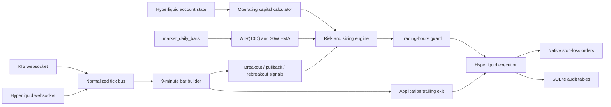

# Strategy Execution Design

This document records the original autonomous entry/add-up design for trade.xyz
RWA assets and the separately implemented trailing worker. The broader strategy
orchestrator remains unimplemented. For the current multi-venue order supervisor,
native trailing with local backup, and risk-unit requirements, use
[protected trading operations](trading-operations.md). Original proposals below
are not proof that those behaviors are active in the current supervisor.

## Risk-policy authority and implementation status

On 2026-09-24, the user confirmed that the decisions in
[issue #15](https://github.com/hwanjjang/kis-hl-trading-system/issues/15)
are authoritative for risk-unit sizing. This supersedes the conflicting
requirements introduced in commit `758a511` and the original cumulative-risk
and add-up-count caps below. It does not change executable behavior: implementing
#15 remains separate work. The capital and position-sizing sections distinguish
the target contract from the current helpers; operational approval and protection
behavior remains owned by [trading operations](trading-operations.md).

## Goals

- Trade only mapped and eligible trade.xyz assets.
- Use KIS as the preferred real-time price source when an active KIS route exists.
- Use Hyperliquid prices when KIS cannot provide the relevant live price.
- Size positions from portfolio value, ATR risk distance, and asset-class-specific risk multipliers.
- Place a native Hyperliquid stop-loss after entry fill confirmation.
- Retain the original application-level trailing design; the current supervisor also supports native trailing with local backup as described in the operations document.
- Keep all live entry and add-up decisions inside the underlying market session unless an explicit risk override is added.

## Non-Goals

- No autonomous entry/add-up strategy daemon is implemented; the separately invoked order supervisor manages explicitly supplied plans.
- The current strategy and trailing management remain long-only. Issue #15 requires symmetric long/short unit calculations; short-side trailing is a separate follow-up, not implemented support.
- KIS was a market-data source in this original Hyperliquid strategy design. Current KIS order routing and account-local protection are documented in the operations document.
- No optimization or parameter fitting is included in this design.

## Capital Model

Confirmed target under #15:

```text
operating_capital_usdc = perp_account_value_usdc * 10
```

Use the intended account's perp clearinghouse `marginSummary.accountValue` only;
exclude spot balances and other-dex collateral. Do not pool main/subaccounts.
Remove the thousand-USDC flooring step and the below-1000 capital guard. Positive
capital, valid stop distance and exchange minimum-size requirements still apply.
The KIS 1x rule is documentation-only within #15; it adds no KIS unit-sizing
implementation and does not remove existing KIS order routing.

Example of the target (before lot rounding and costs):

```text
perp_account_value_usdc = 2372.90
operating_capital_usdc = 2372.90 * 10 = 23729 USDC
risk_per_unit_usdc = 23729 * 0.01 = 237.29 USDC
```

Current implementation gap:

- `calculate_operating_capital()` still returns `floor(value / 1000) * 1000 * 10`, including zero below 1000. Its tests still assert this current behavior; #15 must change both.
- No production order path calls this helper to size orders automatically. Existing managed plans carry explicit quantities and limits; this documentation does not resize them.
- The 10x multiplier is a sizing budget, not an exchange leverage setting. Fresh account evidence and actual venue constraints remain necessary.
- #15 specifies no new per-asset maximum-leverage guard and a report/user-decision flow for an isolated-margin shortfall at the stop, rather than an automatic block solely for that condition. That flow is not implemented; this document does not disable current funds, margin or exposure checks.

## Position Sizing

Confirmed unit-sizing target for each entry or add-up tranche:

```text
risk_per_unit = operating_capital * 0.01
stop_distance = expected_entry_price - fixed_stop_price  # long
stop_distance = fixed_stop_price - expected_entry_price  # short
amount = round_down(unit_count * risk_per_unit / stop_distance, lot_size)
planned_loss_at_stop = amount * stop_distance
entry_notional = amount * expected_entry_price
```

Entry price and the tranche's confirmed fixed stop must be known; reject missing
inputs or non-positive/wrong-side stop distance. ATR × N can derive a proposed
stop, but the unit calculator must accept the explicit stop. Round quantity down;
report a below-minimum result rather than silently rounding up. Report costs and
execution uncertainty separately; planned loss is not a realized-loss guarantee.

Example using the target capital above:

```text
unit_count = 1
expected_entry_price = 100
fixed_stop_price = 90
raw_amount = 237.29 / 10 = 23.729 base-asset units
```

Current helper and implementation boundaries:

- `calculate_position_size()` remains an ATR/N-based helper; explicit-stop unit sizing and its CLI integration are not implemented.
- ATR(10D) needs at least 11 daily bars for previous-close true ranges; `calculate_atr_10d()` supplies that calculation.
- Each future add-up stores its own unit count, entry, stop, distance, quantity and planned risk after rounding.
- The BTC 3H monitor is explicitly outside #15: retain fixed 80 USDC notional and ATR(10D) × 2 stop.
- Current managed-plan funds, lot/tick and exposure checks remain in effect until a separately tested implementation changes them.

## N Multipliers

Initial configurable defaults:

| Asset class | Initial `N` | Rationale |
| --- | ---: | --- |
| `equity_index` | 2.0 | Broad indexes generally gap less than single names. |
| `etf` | 2.5 | ETF gaps and tracking differences are higher than broad cash indexes. |
| `commodity` | 2.5 | Futures and spot-style commodity references can move sharply around inventory, weather, and macro events. |
| `fx` | 2.0 | FX is continuous on weekdays and usually lower-gap than equities. |
| `stock` | 3.0 | Single-name equities have event and gap risk. |

These are starting configuration values, not permanent strategy constants. They must be backtested and reviewed per asset class before live automation.

## Initial Stop-Loss

After an entry order is filled and the actual average entry price is known:

```text
long_stop_price = average_entry_price - (ATR_10D * N)
```

The execution engine must submit a reduce-only Hyperliquid stop-loss order for the filled position size. The preferred order is a stop-market style trigger order, because a stop-limit can fail to fill during a fast move.

Required behavior:

- Do not assume the requested entry price is the filled price.
- Wait for fill confirmation from Hyperliquid user-state/order/fill data.
- If a position opens and the stop-loss order cannot be placed, immediately submit a reduce-only market exit or enter a manual-intervention state.
- Store the stop order ID, client order ID, trigger price, covered size, and source ATR snapshot.
- Reconcile open positions and open stops on every restart.

Hyperliquid supports trigger-style orders through the exchange endpoint and `tp`/`sl` order semantics. The project wraps stop-market trigger payloads through `HyperliquidTradingClient.place_order(order_type="stop-market")` and `place_stop_loss_order()`. Submitted reduce-only stop-market orders are persisted in `protective_orders`, but full automation still needs fill reconciliation, ATR snapshot linkage, and restart reconciliation against live open orders.

## Application-Level Trailing Exit

### Implemented trailing management

The `trailing enroll/run/status/replay` CLI now implements explicit management of
an existing protected long. The broader entry/add-up daemon below remains a plan.
Implementation differences from the original proposal are deliberate:

- Enrollment requires an existing fully filled single entry and verified fixed SL;
  it does not place either order. ATR is frozen from 11 matching closed HL daily
  bars at enrollment, not retrospectively claimed to be the original entry ATR.
  No pre-enrollment intraday watermark is inferred. The existing SL must be at
  least as protective as the newly configured initial floor.
- `Trail` consumes receive-time allMids samples because this feed has no exchange
  event timestamp. Late/out-of-order samples are rejected (zero lateness window).
  The first bucket and any bucket with an excessive gap are ineligible for H/T
  updates. Closed valid bars alone ratchet T; fresh ticks check crossings.
- The CLI runs a single position per worker under a process-held account lock.
  REST reconciliation runs every 10 seconds and before new exit attempts; no
  user-stream reconciliation adapter or multi-host ownership lease is added.
- `trailing_positions`, `trailing_exit_intents`, `trailing_exit_attempts` and
  `trailing_events` are owned by `kis_hl.trailing_storage` in the same SQLite file.
  The snapshot is versioned; a unique decision and updated threshold commit in one
  transaction. Attempts start UNKNOWN before sending and retain their cloid/raw
  response. They supplement the existing manual order/protective audit tables.
- Missing/insufficient native protection enters latched MANUAL_INTERVENTION,
  rather than attempting an unreviewed emergency price/slippage policy. Unknown
  submissions reconcile without blind retry; confirmed terminal attempts may
  retry residual size up to 3 attempts / 120 seconds. Dust and limit exhaustion
  require intervention. Existing verification guards are not relaxed for exits.
- Fill-ledger continuity must cover the original entry through current size.
  Truncated/missing history, extra buys, reversals and unowned open orders fail
  closed. A non-atomic fill/position mismatch waits in RECONCILING for consistent
  snapshots. Native stop cleanup requires flatness and terminal attempt evidence;
  disappearance from open orders alone is insufficient to prove stop termination.
- Paper enrollment and offline replay cannot mutate live orders. A paper crossing
  records PAPER_EXIT and assumes no fill. Replay end/invalid input closes that
  paper run only. `run --recover` is explicit, preserves retry budgets, and never
  adopts another position generation.

The implementation is covered by offline tests; no live fill, disconnect or
cancellation behavior has been verified. Keep the diagram labeled Proposed v1:
its initial-stop stage describes the full intended lifecycle, while this CLI
starts after that stage has been confirmed externally. CLI usage is in README.


### Daily-volatility execution and close-briefing reference requirements

These requirements do not change active plans, live orders or implementation
defaults. Current execution behavior is owned by
[trading operations](trading-operations.md). Research and calibration limits are
in the [multiplier guide](trailing-multiplier-guide.md).

#### Executable TS: shared daily ATR, separate multipliers

Native and nine-minute TS use the same completed-daily-bar ATR calculation with
separate multipliers. Nine minutes describes the local trailing cadence, not
the volatility timeframe. User numerical examples are illustrations only, not
selected values, baselines, candidate grids or calibration priors. In a subsequent
explicit decision, the user accepted starting at nine-minute `2 * ATR(10D)` and
native `3 * the same ATR(10D)`, then adjusting gradually from observed results.
These are approved initial policy values, not empirically optimal parameters.
The separately scoped BTC retrospective rule is unchanged. Independent-distance
implementation and live activation are not completed or authorized by this
policy record; existing positions and orders are not silently migrated.

Native and nine-minute TS are executable protection: an active authorized
trigger begins closing without waiting for daily briefing analysis. Triggering
does not guarantee immediate or complete fills. Current local `Trail.tick`
ratchets from complete nine-minute sampled buckets and checks each fresh price
for breaches. Managed HL uses best bid, legacy trailing uses allMids, and native
trailing follows continuous mark price. Compare effective thresholds rather
than multiplier ordering alone, because watermarks and price bases differ.
Current managed plans share frozen ATR distance across native/local trailing and
initial SL. Separate multiplier support remains an implementation requirement.

#### Close-based TS: explicitly selected automatic or manual mode

The user selects between automatic execution and manual/briefing-reference use
according to the situation. Neither mode is universally mandated. Missing or
ambiguous mode selection must not authorize automatic trading. Do not switch an
active position's mode silently. Persist the selected mode with its authority.

Both modes use volatility calculated from completed daily closes alone, not
highs/lows. For initial manual status checks, the accepted starting calculation
is `V_close = mean(last 10 abs(C_t - C_(t-1)) values)` with a reference distance
of `3 * V_close`, requiring eleven completed daily closes. Give this a distinct
metric identifier instead of redefining standard ATR. This is an observation
starting point, not an empirically calibrated loss boundary; review and adjust
from recorded outcomes. Watermark initialization and update semantics still need
specification before an executable implementation. Do not inherit the manual
multiplier into automatic mode without explicitly selecting and validating that
mode's parameters and authority.

- Automatic: after a valid finalized daily close meets the explicitly configured
  TS condition, an authorized management path persists a reconciled exit intent
  and executes under existing safety rules. Do not trigger from an unfinished
  daily candle or assume a fill at the recorded close. Confirmed exits remain
  latched and reconcile partial fills and competing native/local exits.
- Manual/briefing: report the level, crossing, timestamp, data quality and chart/
  strategy context. A crossing is evidence, not a mandatory sell, and creates no
  exit intent, executable order, or protection change. A subsequent trade needs
  a separate applicable decision and authorization.

Chart analysis or another selected strategy may support selling before TS in
either mode; TS is not an AND gate for all exits. A briefing recommendation is
not itself an order. Native/local protection remains independent and must not be
delayed, widened or disabled merely to wait for the daily-close policy. Confirm
concurrent protection explicitly: an intrabar stop can preempt daily confirmation.

Pin instrument, price basis, daily session/timezone, finalization and entry-day
coverage. Missing inputs yield an explicit unavailable/degraded state, never an
invented crossing; retain verified protection. Do not substitute the next
session's opening quote for the previous daily close.

#### Entry SL and strategy decisions remain independent

At entry, choose SL from chart structure and relevant strategy evidence. A
pullback setup can use an invalidation price rather than an ATR multiple. Support
an explicit stop price and rationale; volatility-derived SL is an option, not
a universal requirement. Briefing references neither define nor replace the
actual protective entry SL.

Size using approved entry-to-protective-stop loss exposure, costs and account
risk limits, not the briefing reference or a tighter TS distance. Do not widen
existing stops or increase size without authorization. Keep chart/strategy sells,
executable TS triggers and analytical reference crossings distinct in records.
A strategy sell need not wait for TS; a briefing recommendation is not an order.

#### Verification and research requirements

For executable TS, test shared daily ATR with independent multipliers, ratchet
and breach semantics, gaps, restart idempotency, partial fills, native/local
races and reduce-only cleanup. Compare net returns, costs, drawdowns, tail loss
and giveback under fixed entry/SL/strategy rules. Daily OHLC cannot establish
native intrabar trigger ordering.

For both close modes, test invariance to high/low-only changes, finalized daily
inputs, explicit missing-data output and explicit mode selection. Manual mode
must create no exit intent/order/protection change on a crossing; evaluate its
briefing usefulness and warning quality. Automatic mode requires authorized,
idempotent exit handling, partial-fill reconciliation and native/local race
coverage; evaluate net returns and tail risks with realistic post-close fills.
A mode change must not retrospectively execute an old manual-mode observation
without a newly authorized, reconciled decision.

These requirements are documented, not implemented or empirically validated.
This clarification starts no orders, monitors or scheduled jobs.

### Original first-release proposal (implementation scope above)

Use an application-managed trailing exit plus an independently resting native
Hyperliquid stop-loss. Keep the native stop at its initial protective level in
v1; the application submits a reduce-only exit when its trailing threshold is
crossed. This preserves the existing strategy model and avoids adding stop
replacement races to the first release. A process outage preserves only the
native stop, not the latest application profit-protection level.

Scope: long-only perpetual positions, one managed position per account/dex/coin,
within the existing live eligibility rules. Spot management, shorts, automatic
adoption of manual positions, add-ups, and concurrent strategies on the same coin
are outside the first release. Disable managed-symbol entries while an exit or
recovery is pending. No live asset set is widened by this proposal.

### Calculation and activation

Freeze `ATR_10D`, `N`, their source/version, and price units when the initial fill
is reconciled. Let `E` be the actual volume-weighted entry price and `D = ATR_10D * N`.
Reject non-positive inputs and a non-positive initial stop.

```text
initial_stop = E - D
H = E
T = initial_stop
on each valid closed post-entry 9-minute bar:
    H = max(H, bar.high)
    T = max(T, initial_stop, H - D)
on each fresh selected price P, including immediately after a T update:
    if P <= T: persist one exit intent
```

Activate after the native stop is confirmed live with sufficient coverage. No
profit-activation threshold or automatic breakeven rule is added in v1. ATR is
not recomputed during the position, so increased volatility cannot widen the
stop. Both H and T are monotonic. If tick rounding is needed, use the legal long
sell-stop level at or below the raw threshold; validate the risk impact and never
lower an already established effective threshold. Use Decimal calculations.

Example: E=100, ATR=2, N=2 gives D=4 and initial stop=96. A closed bar high of 108
raises T to 104. A later high of 106 leaves T at 104. A fresh price of 104 or lower
creates an exit intent; the execution price is not guaranteed to be 104.

### Candles and price basis

Use event-time UTC buckets `[floor(t / 540000) * 540000, start + 540000)`.
Only post-fill ticks contribute. Discard the entry bucket from watermark updates
if complete post-entry coverage cannot be established. Finalize after a bounded,
configured lateness allowance; ignore duplicates and quarantine events arriving
after finalization. Never revise past decisions using later data. Persist the
processed bar ID with H/T so a replay cannot apply a bar twice. Missing or degraded
bars do not advance H; the last valid T remains active for fresh-price checks.
The 9-minute delay intentionally ignores unclosed intrabar highs.

The broader strategy prefers KIS when a usable route exists. For trailing v1,
pin the management price source to Hyperliquid for the position lifetime and use
Hyperliquid daily ATR in the same instrument units. This is a deliberate narrower
management policy: entry signals may still use KIS, but raw KIS prices or ATR must
not be compared with Hyperliquid entry prices or thresholds. If matching ATR is
unavailable, automated management must not be activated for a new entry.

Use the existing allMids stream for application bars and crossing checks; label
these as mid-price signals. Hyperliquid native TP/SL triggers use mark price, so
the two protections may fire at different times. A future mark-based mode needs
a tested market-context adapter and its own persisted price basis.

Supporting KIS-managed trails later requires an explicit, versioned conversion
contract for currency, units, instrument scale and market basis. Maintain a
separate watermark per source basis; neither switch sources under an old H/T nor
blend ticks in a candle. A source change must reconcile the conversion and
protective level before resuming. Unverifiable conversion means degraded mode.

Freshness must be per symbol, with monotonic receive-age, source event time when
available, connection generation and gap flags. allMids receive time alone does
not prove that the underlying market traded recently. Reject invalid prices,
out-of-order updates and replay snapshots as new high-watermark evidence. Set
freshness and reconnect thresholds explicitly in the paper-run configuration;
calibrate them from recorded feed cadence before live release.

### Execution and state

```text
RECOVERING -> PROTECTED -> EXIT_PENDING -> FLAT_CLEANUP -> CLOSED
                  |             |
                  v             v
               DEGRADED <-> RECONCILING
unprotected position -> EMERGENCY_EXIT or MANUAL_INTERVENTION
```

DEGRADED means the fixed native protection remains verified, but trailing updates
are suspended. If protection is unknown, enter RECONCILING; do not label a locally
stored stop as verified protection. Keep the prior T and resume only with fresh,
consistent data. Once an exit intent exists, a price rebound does not cancel it.

1. Serialize actions per account/dex/coin under a process lock held for the full
   worker lifetime. Use one supervised CLI worker and one submission owner per
   account; multi-host writers are outside v1. A SQLite transaction atomically
   saves the threshold decision, state transition and exit intent before sending.
2. Reconcile current position and known outstanding exit orders. Submit only the
   remaining positive long size, rounded to permitted lot precision, with
   `reduce_only=True`, a bounded slippage price and IOC semantics.
3. Persist an exchange-compatible 128-bit cloid before sending. The local
   `client_request_id` is not an exchange cloid. Track each attempt separately;
   cloid is a reconciliation key, not a guarantee of exactly-once submission.
4. On timeout, record UNKNOWN and query order status, open orders, fills and
   position before any resend. An absent open order alone does not prove failure.
   If acceptance remains ambiguous, block resubmission and require reconciliation.
5. IOC acceptance is not full closure. Reconcile fills and residual position;
   use a new linked attempt only after the previous attempt is terminal. Bound
   retries by count/time/slippage. On exhaustion retain protection, block entries
   and raise a structured manual-intervention event. Do not silently increase
   slippage. Handle residual dust explicitly rather than rounding it to flat.
6. Keep the native stop active during exit submission. If it triggers concurrently,
   refresh size and cancel any now-unneeded managed exit orders. Every exit must
   be reduce-only so a race cannot open a short.
7. Confirm the actual position is flat, cancel this position generation's remaining
   managed protective orders, and confirm cleanup before permitting re-entry.
   A stale reduce-only stop could otherwise affect a future position in the same
   coin. Never cancel unowned/manual orders.

The unsafe `market_open()` reduce-only path is now fixed. Generic reduce-only
market orders verify the side against the current position and submit a rounded,
fixed-side reduce-only IOC through `exchange.order`. The trailing worker uses its
reconciled quantity and persisted cloid with the same explicit IOC semantics.
Per-order rejection responses are returned as `status="rejected"`; successful
submission still requires independent fill/coverage verification.

Keep existing allowlist, metadata freshness and credential guards. Current
reduce-only paths bypass entry-session checks but still require recent metadata
verification. If that guard blocks a needed exit, record it and escalate while
retaining the native stop. A separate authorization policy for exits from an
existing verified position would require an explicit safety-policy change.

### Persistence and recovery

Extend the already proposed `position_state` with position-generation ID,
account/dex/coin, initial fill identity/time, side/size, E, frozen ATR/N/D, initial
stop, price basis, H/T, last processed bar, native stop identifiers, last verified
coverage/time, state and version. Store prices/sizes as decimal strings.

Add `exit_intents` containing a unique decision key `(position_id, exit_reason)`,
trigger event/threshold, status and creation time. Add `exit_order_attempts` linked
to that intent with cloid, exchange oid, requested/filled size, limit price,
response/error, reconciliation status and timestamps. Reuse `order_submissions`
for raw submission evidence and extend `protective_orders` for reconciled status;
its local active flag alone is insufficient. Keep dry-run and live state isolated.

On startup, acquire ownership, disable entries and reconcile actual account state,
managed open orders and unresolved attempts before consuming new signals. Restore
H/T from SQLite; never reset them to the current price. Replay only complete,
verified same-source post-entry data. For an unfillable data gap, keep the last
saved T and report missed-high uncertainty; do not invent an outage watermark.
If a fresh price is already below T, create or resume the same exit intent.

A manual partial close updates residual size and stop coverage. An unexpected
increase, reversal or unknown position generation enters MANUAL_INTERVENTION;
never silently adopt it. A confirmed external full close goes through cleanup.
A missing native stop blocks entries and invokes the initial-stop failure policy.

Log position_id, intent_id, attempt_id, cloid/oid, event time, source/basis,
old/new H/T, quantity, state transition, cause, action and result. Persist pending
intent and state before external effects; log transitions rather than every tick.

### Implementation lanes and acceptance gates

These are sequential implementation slices, not authorization to trade live:

| Slice | Intended files | Required evidence |
| --- | --- | --- |
| Safe exit primitive | `kis_hl/hyperliquid/client.py`, matching client tests, Hyperliquid skill references | SDK receives reduce-only IOC and cloid; tick/lot, rejection and timeout tests |
| Pure trailing calculation | New `kis_hl/trailing.py`, `tests/test_trailing.py` | H/T never decrease; equality crossing; frozen ATR; entry bucket, duplicates, gaps and stale-price tests |
| Durable state | `kis_hl/storage.py`, matching storage tests | Atomic intent/state write, unique decisions, generation isolation, crash recovery |
| Reconciliation and worker | New `kis_hl/trailing_runner.py`, client/info and websocket adapters, matching tests | Unknown acceptance, partial fills, simultaneous native stop, manual changes, missing protection, restart and worker ownership tests |
| CLI and paper rollout | `kis_hl/cli.py`, CLI tests, README and owning docs | Dry-run default, explicit management enrollment, recorded-tick replay, no unintended writes to live state |

Write behavior tests before each production slice. Test crash points before send,
after exchange acceptance but before local acknowledgement, and during cleanup.
Existing websocket clients need integration; they do not provide this state
machine by themselves. Expose status including degraded reason and verified stop
coverage before exposing a long-running management command.

Native stop ratcheting is a later option when preserving the latest profit floor
through an application outage is required. Add modify/cancel wrappers with their
own safety tests, coalesce improvements and reconcile every ambiguous response.
Do not implement cancel-then-create as an unprotected two-step replacement, and
do not assume modify failure preserves the old stop without verification. Never
submit a replacement trigger already crossed; use the reconciled exit path.

Outstanding live risks: sampled mid-price bars can miss traded highs, market/mark
basis can diverge, gaps can exceed the stop or slippage tolerance, IOC can leave
residuals, and an application outage loses trailing updates. Exchange order and
reconnect behavior must be validated before live activation. No profit or maximum
loss guarantee follows from this design.

## Entry And Add-Up Model

The initial strategy model is long-only and trend-following.

### Universe Filter

An asset is eligible for signal evaluation only when all conditions pass:

- `trade_xyz_assets.tradable = 1`.
- The Hyperliquid `xyz:` market has a recent successful verification row.
- The latest Hyperliquid `xyz` universe snapshot still contains the symbol.
- Recent funding-rate and spread snapshots are available for suitability review.
- Daily bars and ATR are fresh.
- The latest weekly close is above 30-week EMA. `kis_hl.risk.calculate_30w_ema_status()` implements the current weekly EMA calculation from daily bars.
- The underlying market session is open according to `docs/trading_hours.md`.
- The live price source is fresh.

### High-Probability Entry Gate

Every entry and add-up signal must pass a quality gate before risk sizing and order preparation. This gate keeps trade selection systematic instead of discretionary.

Required checks:

- Trend: the higher timeframe trend must agree with the trade direction. For this project, long-only entries require the 30-week EMA filter to pass and should prefer higher-high/higher-low structure on daily or 4H context.
- Confluence: the setup must have more than one supporting factor. Accepted factors can include support/resistance, moving-average alignment, prior breakout level, ATR band interaction, or another documented level. Confluence that is not machine-coded yet must be recorded as operator notes before live approval.
- Price action confirmation: the selected candle must confirm the entry. Examples include a close above resistance, a breakout-and-retest close, a rejection candle at support, or a bullish reversal pattern after pullback. A tick-only move is not enough for normal entries.
- Plan completeness: entry basis, stop-loss basis, take-profit or management plan, ATR snapshot, N value, and risk budget must be known before the order is sent.
- Risk and management: per-tranche risk must remain within the configured cap, stop-loss placement must be ready, and the trade must have a rule for breakeven stop movement or trailing-exit handling after price moves in favor.
- Reviewability: the setup label and entry-quality notes must be journalable so the completed trade can be reviewed against the original reason for entry.

The first implemented BTC rule satisfies only the price-action part of this gate by checking a closed 3H spot candle breakout. It still needs persisted confluence notes, trade-plan records, and fill-aware management before it should be treated as a fully automated high-probability entry system.

### Breakout Entry

Default intent:

- Buy when price breaks above a configured resistance or lookback high.
- Require confirmation from the selected live source.
- Store the breakout level, ATR snapshot, N value, operating-capital snapshot, and signal timestamp.

BTCUSDC futures rule:

Activation is governed by the [independent opt-in strategy policy](trading-operations.md#btc-three-hour-strategy-activation-policy).
The implementation below does not imply default activation or trading authority.

- Resolve explicit futures symbols such as `BTCUSDC-PERP`, `BTC-PERP`, and `BTCPERP` to the Hyperliquid `BTC` perp coin.
- Use Hyperliquid BTC spot websocket mids as the monitoring price source.
- Build closed `3h` spot candles from those mids.
- The default breakout level is the immediately prior closed 3H candle high.
- A long-entry signal is valid when the latest closed 3H spot candle close is strictly greater than that breakout level.
- `--lookback-candles` can evaluate against the highest high across more prior candles, but the production default remains the immediately prior candle until backtests select a broader lookback.
- `kis_hl.signals.evaluate_btcusdc_futures_3h_breakout()` implements the candle breakout check.
- `kis_hl.btc_strategy.BtcSpotBreakoutPerpStrategy` wires spot websocket ticks to the breakout rule and creates a BTC perp long-entry plan.

BTCUSDC futures execution defaults:

- Entry instrument: Hyperliquid `BTC` perp via `BTCUSDC-PERP`.
- Entry side: long.
- Entry order type: market.
- Entry notional: `80 USDC`.
- Entry size: `80 / entry_price`.
- Stop-loss: reduce-only stop-market sell.
- Stop-loss trigger: `entry_price - (ATR(10D) * 2)`.
- ATR source: explicit `--atr-10d` override or Hyperliquid BTC perp `1d` candle snapshot.

Current limits:

- The monitor prevents duplicate entries only inside the running process.
- Existing BTC positions are not reconciled before live entry.
- Stop placement uses the signal close as entry reference until fill reconciliation is implemented.
- A restart can forget that an entry was already planned unless persisted position state is added.

### Pullback Add-Up

Default intent:

- Add only after the initial breakout position is profitable or at least not violating the current stop.
- Wait for a pullback toward a configured reference such as a short moving average, prior breakout level, or ATR band.
- Add when price resumes upward from the pullback area.

Guards:

- Do not add below the current effective stop.
- Under #15, no preset cumulative unit cap or add-up count limit is imposed. Report available margin and let the user decide whether to fund or skip a tranche when margin is short; the approval/execution integration is still pending.
- Each add-up tranche must have its own sizing record and stop-distance calculation.

### Rebreakout Add-Up

Default intent:

- Add when price breaks above the most recent post-entry swing high or consolidation high.
- Require the 30-week EMA filter and session guard to still pass.
- Recompute available risk and exposure before adding.

## Portfolio Risk Caps

The original proposed 2% per-asset cap, 6% portfolio cap and maximum two add-ups
are superseded by #15. There is no preset per-asset cumulative unit cap, portfolio
unit cap or add-up count limit in the confirmed target. One unit defines 1% planned
loss at the fixed stop; it is not a one-unit maximum per tranche.

Recalculate open risk from current stop prices. Under #15, a verified trailing-stop
improvement can free unit budget for another entry/add-up. Each new tranche still
uses its own entry and fixed-stop distance; do not substitute an anticipated
tighter trailing threshold to inflate that tranche's size. This reuse is a target
workflow, not automatic permission to submit another order.

Current managed-plan gross/correlated notional limits and execution checks remain
mandatory. They are different from the proposed cumulative loss-at-stop unit caps;
this documentation does not remove them or invent an unlimited execution grant.

## Websocket Architecture

### KIS Stream Manager

Responsibilities:

- Authenticate REST and websocket credentials.
- Subscribe to real-time price feeds for active KIS routes.
- Maintain per-symbol stream status, last message timestamp, and parse errors.
- Reconnect with bounded exponential backoff.
- Resubscribe after reconnect.
- Emit normalized `price_tick` events with source, symbol, exchange, price, size, event time, receive time, and raw payload reference.

The official KIS sample repository uses websocket authentication before starting websocket subscriptions and includes domestic and overseas stock realtime examples. This project implements approval-key acquisition, subscription payload construction, ping echo handling, reconnects, and stale detection in `kis_hl.kis.ws`.

### Hyperliquid Stream Manager

Responsibilities:

- Subscribe to `allMids` for the `xyz` dex for RWA prices.
- Subscribe to user fill/order/clearinghouse state streams for execution reconciliation.
- Optionally subscribe to candle feeds for fallback bars, but local 9-minute bars should still be built from normalized ticks for consistency.
- Detect stale streams and reconnect with backoff.
- Emit normalized ticks and execution events.

Hyperliquid websocket subscriptions return a subscription response and then channel-specific data messages. The official websocket docs include `allMids` subscriptions, user events, fills, BBO, and candle subscriptions. This project implements subscribe payloads, heartbeat pings, reconnects, stale detection, and `allMids` tick parsing in `kis_hl.hyperliquid.ws`.

## Data Flow



## Proposed SQLite Tables

The existing `market_ticks`, `market_daily_bars`, and `order_submissions` tables are useful but not enough for a live strategy daemon.

Proposed additions:

| Table | Purpose |
| --- | --- |
| `portfolio_snapshots` | Hyperliquid account value, margin, and derived operating capital. |
| `market_price_ticks` | Normalized tick stream with source freshness metadata. |
| `market_9m_bars` | Local 9-minute OHLCV bars by selected source. |
| `asset_indicators` | ATR(10D), 30W EMA, latest weekly close, and calculation inputs. |
| `strategy_signals` | Breakout, pullback add-up, rebreakout add-up, trailing-exit signals. |
| `position_plans` | Intended size, stop distance, N, operating-capital snapshot, and risk budget. |
| `position_state` | Current reconciled Hyperliquid position, average entry, covered stop size, and high watermark. |
| `protective_orders` | Native stop-loss order IDs, trigger prices, status, and coverage checks. |
| `trade_journal_entries` | Completed trade records and review-statistics snapshots. |
| `stream_status` | Per-source connection health, last event time, reconnect count, and active subscriptions. |

Already implemented market-review tables:

| Table | Purpose |
| --- | --- |
| `trade_xyz_universe_snapshots` | Point-in-time Hyperliquid `xyz` universe snapshots, including new and missing symbols. |
| `trade_xyz_universe_assets` | Per-market metadata from each universe snapshot, including 24h base volume, 24h notional volume, and open interest when Hyperliquid provides them. |
| `market_funding_rates` | Hyperliquid hourly funding-rate and premium history by `xyz` symbol. |
| `market_spread_snapshots` | Top-of-book best bid, best ask, mid, absolute spread, spread bps, and top-level size snapshots. |

All tables should store raw payload references or raw JSON where external schemas may change.

## Trade Journal

Every completed trade should produce a journal entry. Until position close reconciliation is implemented, operators should call `journal add` manually after a trade is fully closed.

The required statistics snapshot is calculated from unweighted per-trade net return percentages and includes:

- Average profit.
- Average loss.
- Success/failure ratio, calculated as average profit divided by absolute average loss.
- Win rate, calculated over non-breakeven trades.
- Adjusted success/failure ratio, weighting average profit and loss by win and loss frequency.
- Max profit.
- Max loss.
- Average profit holding days.
- Average loss holding days.

The journal stores a statistics snapshot with each entry so the review context is preserved even if later trades change aggregate results. The legacy `adjusted_outcome` input remains storage-compatible but does not alter the required statistics. `.agents/skills/trade-journal/` owns the detailed record and formula contract.

## Execution State Machine

```text
DISABLED
  -> READY after config, assets, daily bars, indicators, streams, and account snapshot pass checks
READY
  -> ENTRY_PENDING after a valid breakout signal and risk approval
ENTRY_PENDING
  -> POSITION_OPEN after fill reconciliation
  -> READY if entry order expires, cancels, or rejects
POSITION_OPEN
  -> STOP_ARMING immediately after fill
STOP_ARMING
  -> PROTECTED after native stop-loss confirmation
  -> EMERGENCY_EXIT if native stop-loss cannot be armed
PROTECTED
  -> ADD_PENDING after pullback or rebreakout add-up approval
  -> EXIT_PENDING after trailing exit, native stop trigger, manual exit, or session/risk override
ADD_PENDING
  -> STOP_ARMING after add fill reconciliation
EXIT_PENDING
  -> READY after position is flat and managed protective-order cleanup is confirmed
EMERGENCY_EXIT
  -> READY only after position is flat and reconciliation is clean
```

## Failure Policy

Live entries and add-ups fail closed when:

- Account value is stale, unavailable or non-positive. The confirmed #15 target has no 1,000-USDC minimum; the current helper still needs to be updated.
- ATR or 30W EMA is missing or stale.
- Hyperliquid metadata verification is stale.
- The underlying market session is closed.
- Both KIS and Hyperliquid live prices are stale.
- Position size cannot be rounded safely.
- Recent funding or spread data is missing when the operator has configured these checks as mandatory.
- Native stop-loss cannot be submitted after a fill.
- Open position state cannot be reconciled.

Risk-reduction exits may continue when:

- The primary KIS stream is stale but Hyperliquid fallback prices are fresh.
- The underlying market session is closed but an emergency exit is required.
- A native stop order is missing, partially covering, or rejected.

Every abnormal path must produce structured logs with cause, action, and result.

## Implementation Sequence

1. Add pure calculation modules and tests for operating capital, ATR(10D), 30W EMA, stop distance, and amount rounding.
2. Add asset-class `N` configuration and tests.
3. Add the session guard using `docs/trading_hours.md`.
4. Persist and reconcile Hyperliquid trigger stop-loss orders across restarts.
5. Wire KIS and Hyperliquid websocket clients into persistent tick tables.
6. Add 9-minute bar building and source freshness logic.
7. Add signal generation for breakout, pullback add-up, and rebreakout add-up.
8. Add reconciliation for positions, fills, native stops, and restart recovery.
9. Add dry-run/paper replay mode using recorded ticks and daily bars.
10. Enable live mode only after end-to-end dry-run evidence exists.

## References

- Hyperliquid websocket subscriptions: https://hyperliquid.gitbook.io/hyperliquid-docs/for-developers/api/websocket/subscriptions
- Hyperliquid exchange endpoint: https://hyperliquid.gitbook.io/hyperliquid-docs/for-developers/api/exchange-endpoint
- Hyperliquid order types: https://hyperliquid.gitbook.io/hyperliquid-docs/trading/order-types
- Korea Investment Open Trading API sample repository: https://github.com/koreainvestment/open-trading-api
- KIS domestic websocket sample: https://github.com/koreainvestment/open-trading-api/blob/main/examples_user/domestic_stock/domestic_stock_examples_ws.py
- KIS overseas websocket sample: https://github.com/koreainvestment/open-trading-api/blob/main/examples_user/overseas_stock/overseas_stock_examples_ws.py

- Hyperliquid TP/SL trigger basis: https://hyperliquid.gitbook.io/hyperliquid-docs/trading/take-profit-and-stop-loss-orders-tp-sl
- Hyperliquid SDK order helpers: https://github.com/hyperliquid-dex/hyperliquid-python-sdk/blob/master/hyperliquid/exchange.py

Trailing IOC attempts carry a signed `expiresAfter` equal to the source price receive time plus its configured freshness budget. Local age checks include all reconciliation work; the exchange expiry also bounds delayed delivery. An expiry rejection consumes the existing bounded retry budget.
